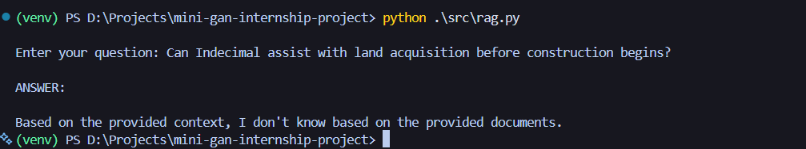

# RAG Evaluation Summary

## Setup
- Embeddings: all-MiniLM-L6-v2
- Vector Store: FAISS (cosine similarity)
- LLM: Local open-source model via Ollama (phi-2)
- Top-K retrieval: 3

## Observations

### Retrieval Quality
- Retrieved chunks were generally relevant to the user query.
- Queries related to pricing, quality checks, and transparency showed strong alignment.
- Some broader questions retrieved overlapping but still useful context.

### Out-of-Scope Query Handling
- Queries not covered by the document corpus correctly resulted in
  "I don't know based on the provided documents."
- This confirms effective grounding and hallucination prevention.

### Answer Groundedness
- Answers were consistently grounded in retrieved document chunks.
- The system correctly responded with "I don't know" when context was insufficient.

### Hallucinations
- No major hallucinations observed.
- Grounding prompt successfully prevented unsupported claims.

### Limitations
- Small document set limits answer depth.
- No reranking or hybrid search implemented.
- Local LLM occasionally produced concise but less fluent responses.

### Potential Improvements
- Add reranking (cross-encoder).
- Increase chunk-level metadata (section titles).
- Introduce hybrid BM25 + vector search.
